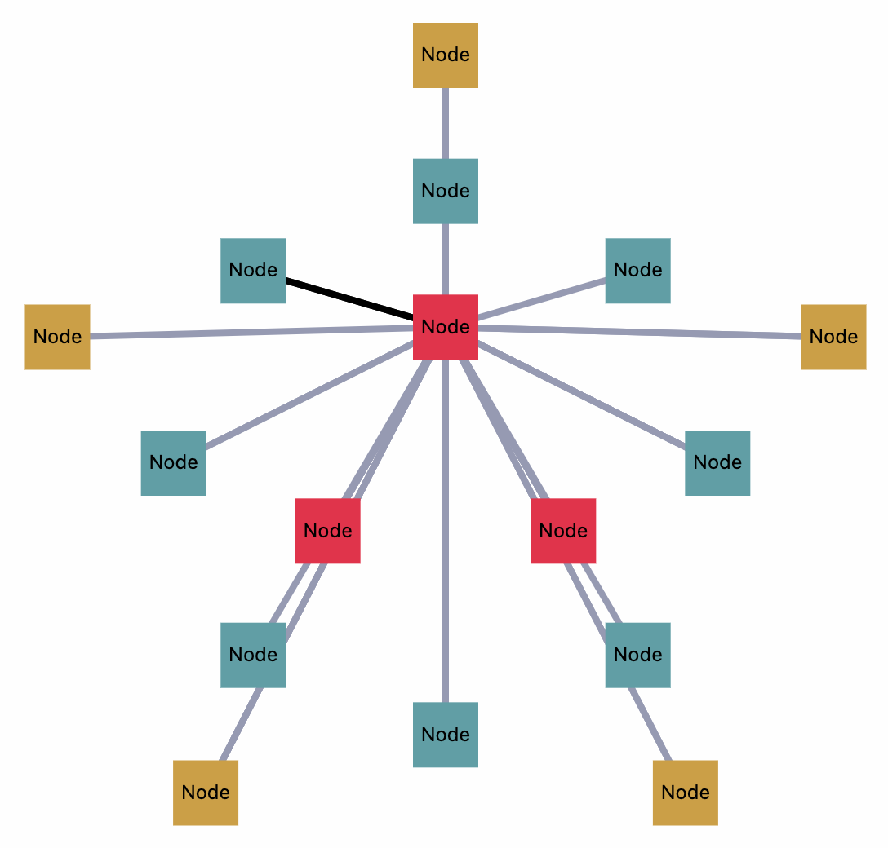

# react-network-graph-svg

A React component for rendering network graphs as SVG.



## Installation

```bash
npm install @aimabel/react-network-graph-svg
```

## Usage

```tsx
import React from 'react';
import { NetworkGraphSVG, Node, Edge } from '@aimabel/react-network-graph-svg';

const nodes: Node[] = [
  { id: 1, label: 'Node 1', tier: 1 },
  { id: 2, label: 'Node 2', tier: 2 },
  { id: 3, label: 'Node 3', tier: 3 },
];

const edges: Edge[] = [
  { from: 1, to: 2 },
  { from: 2, to: 3 },
];

function App() {
  return (
    <NetworkGraphSVG
      nodes={nodes}
      edges={edges}
      width={400}
      height={400}
    />
  );
}
```

## Props

### NetworkGraphSVG

| Prop | Type | Required | Default | Description |
|------|------|----------|---------|-------------|
| `nodes` | `Node[]` | Yes | - | Array of nodes to render |
| `edges` | `Edge[]` | Yes | - | Array of edges connecting nodes |
| `width` | `number` | No | `400` | Width of the SVG canvas |
| `height` | `number` | No | `400` | Height of the SVG canvas |
| `defaultNode` | `object` | No | See below | Default styling for nodes |
| `defaultEdge` | `object` | No | See below | Default styling for edges |

### Node

| Prop | Type | Required | Default | Description |
|------|------|----------|---------|-------------|
| `id` | `number` | Yes | - | Unique identifier |
| `label` | `string` | Yes | - | Text label to display |
| `title` | `string` | No | - | Tooltip text |
| `shapeType` | `'circle' \| 'square'` | No | `'circle'` | Shape of the node |
| `lineColor` | `string` | No | `'#000'` | Border color |
| `lineWidth` | `number` | No | `1` | Border width |
| `fillColor` | `string` | No | `'#fff'` | Fill color |
| `tier` | `number` | No | `3` | Positioning tier (1=inner, 2=middle, 3=outer) |
| `onClick` | `() => void` | No | - | Click handler |

### Edge

| Prop | Type | Required | Default | Description |
|------|------|----------|---------|-------------|
| `from` | `number` | Yes | - | Source node ID |
| `to` | `number` | Yes | - | Target node ID |
| `label` | `string` | No | - | Edge label |
| `title` | `string` | No | - | Tooltip text |
| `lineColor` | `string` | No | `'#000'` | Line color |
| `lineWidth` | `number` | No | `1` | Line width |
| `onClick` | `() => void` | No | - | Click handler |

## Default Styles

```tsx
// Default node styling
defaultNode: {
  shapeType: 'circle',
  lineColor: '#000',
  lineWidth: 1,
  fillColor: '#fff',
}

// Default edge styling
defaultEdge: {
  lineColor: '#000',
  lineWidth: 1,
}
```

## License

MIT 